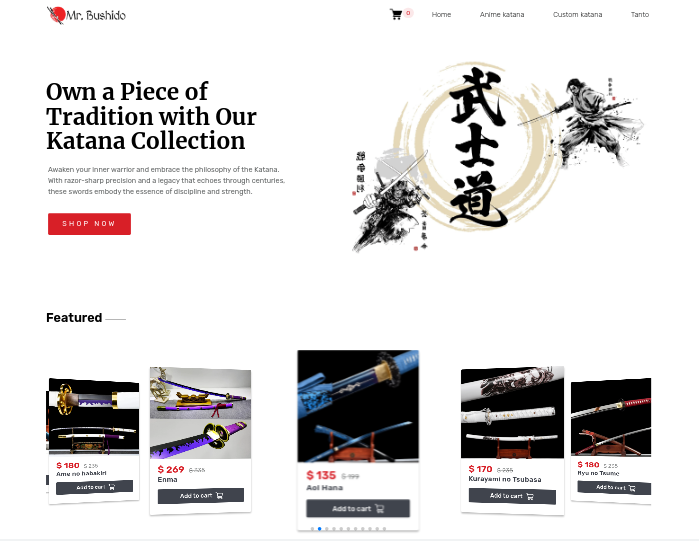

<div id="top"></div>

<div align="center">
  <h2 align="center">Mr. Bushido</h2>
  <p align="center">
    <br />
    <br />
    <a href="https://katana-ecommerce.vercel.app/" target="_blank">View Demo</a>
    ·
    <a href="https://github.com/mahdipratama/katana-ecommerce" target="_blank">Report Bug</a>
    ·
  </p>
</div>

<!-- Bagdes -->
<div align="center">
  <!-- Profile -->

  <!-- Status -->
  <a href="#">
    
  </a>

</div>

#

<div align="center">



</div>

## The Challenge

This is Fullstack E-Commerce platform using <a href='https://nextjs.org/' target=_blank>Next.js</a> and Tailwind CSS for responsive styling.
<br/>
In the <a href='https://github.com/mahdipratama/one-for-all'>previous project</a> I've already learn how to integrated a <a href='https://stripe.com/docs/webhooks' target=_blank>Stripe payment method</a>
<br/>
Now the challenge is to enable <a href='https://stripe.com/en-gb-us' target=_blank>webhook events</a> to receive events as they occur in Stripe accounts, so that my backend systems can execute actions accordingly to retrieve a piece of information about the payment.
<br/>
<br/>
Of course, this payment is just a simulation, so I used a Stripe <a href='https://stripe.com/docs/test-mode'>test-mode</a> account for that, -- use `4242 4242 4242 4242` as a test card number with any CVC + future expiration date.
<br>

- Users should be able to:
  - Browse Product Catalog, The site provides a structured and organized display of products or services available for purchase. Each item typically includes detailed descriptions, images, prices, and other relevant information.
  - Users can add products to their virtual shopping carts while browsing. The shopping cart allows users to review and modify their selected items before proceeding to checkout.
  - Effective search and navigation features help users quickly find the products they're interested in. This includes filters, categories, and sorting options.
  - The sites integrate with stripe payment methods.
  - Optimized for various screen sizes and devices to provide a seamless shopping experience.
    <br>

## **What I learned**

- Handled the routing system with Next.js <a href='https://nextjs.org/docs/pages/building-your-application/routing'>file-based routing system</a>
- Using `API routes` to enable the creation of `serverless functions` to handle `API requests`
- Created a function for establishing a connection to a <a href='https://www.mongodb.com/atlas/database' target=_blank>MongoDB database</a> using Mongoose, an Object Data Modeling (ODM) library for MongoDB, and a little bit of Node.js.
- Created schemas or models for interacting with the <a href='https://www.mongodb.com/atlas/database' target=_blank>MongoDB database</a> using Mongoose.
- Integrating the website into the <a href='https://stripe.com/en-gb-us' target=_blank>Stripe </a>payment method with webhook events.
- Display products with filters by category, and sorting options.
- Add skeletons as a loading state
- A lot of minor things

<br>

<h2 align="center">Links</h2>

- Live Site URL: [https://katana-ecommerce.vercel.app/](https://katana-ecommerce.vercel.app/)

<br>

## Table of contents

[](#)

- [](#)
  - [The Challenge](#the-challenge)
  - [**What I learned**](#what-i-learned)
  - [Table of contents](#table-of-contents)
  - [My process](#my-process)
    - [Built with](#built-with)
  - [Instructions](#instructions)

## My process

### Built with

<!-- Bagdes -->


## Instructions

When using `Next.js` in order to build this project

- Install all dependencies:

```bash
npm install
```

- If you want to edit the code and test, in the root folder of this repository, run this command from the command line:

```bash
npm run dev
```

- Run build command from command line:

```bash
npm run build
```
